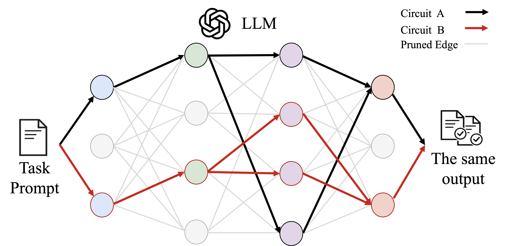

# All Circuits Lead to Rome: Rethinking Functional Anisotropy in Circuit and Sheaf Discovery for LLMs

Official code release for the ICML 2026 paper *All Circuits Lead to Rome: Rethinking Functional Anisotropy in Circuit and Sheaf Discovery for LLMs*.

> **Xi Chen**\*, **Mingyu Jin**\*, **Jingcheng Niu**\*; Yutong Yin, Jinman Zhao, Bangwei Guo, Dimitris N. Metaxas, Zhaoran Wang, Yutao Yue, Gerald Penn
>
> University of Toronto / Rutgers University / TU Darmstadt / Northwestern University / HKUST (Guangzhou)
>
> \*Equal contribution. Work done while at the University of Toronto.
>
> Contact: [xichen@cs.toronto.edu](mailto:xichen@cs.toronto.edu)



## TL;DR

**We find that multiple structurally distinct circuits can perform the same LLM task**: each one sparse, faithful, and complete, yet sharing almost no edges with the others. This directly contradicts the **Functional Anisotropy Hypothesis**, the largely implicit assumption in circuit and sheaf discovery (CSD) that a task is implemented by a unique or near-unique internal mechanism. We introduce **Overlap-Aware Sheaf Repulsion (OASR)** to systematically uncover these competing circuits, and show that the phenomenon holds across major CSD methods (ACDC, EAP, Edge Pruning, DiscoGP) and tasks (IOI, BLiMP, AGA/ANA/DNA, Docstring).

## Abstract

In this paper, we present empirical and theoretical evidence against a central but largely implicit assumption in circuit and sheaf discovery (CSD), which we term the *Functional Anisotropy Hypothesis*: the idea that functions in large language models (LLMs) are localised to a unique or near-unique internal mechanism. We show that a single LLM task can instead be supported by multiple, structurally distinct circuits or sheaves that are simultaneously faithful, sparse, and complete. To systematically uncover such competing mechanisms, we introduce **Overlap-Aware Sheaf Repulsion**, a method that augments the CSD objective with an explicit penalty on structural overlap across multiple discovery runs, enabling the discovery of circuits or sheaves with strong task performance but minimal shared structure across a plethora of common CSD benchmarks. We find that this phenomenon becomes increasingly pronounced as the number of discovered sheaves grows and persists robustly across major CSD methods. We further identify an ultra-sparse three-edge sheaf and show that none of its edges is individually indispensable, undermining even weakened notions of canonical or essential components. To explain these findings, we propose a *Distributive Dense Circuit Hypothesis* and provide a theoretical analysis demonstrating that non-unique, low-overlap circuit explanations arise naturally from high-dimensional superposition under mild assumptions. Together, our results suggest that mechanistic explanations in LLMs are inherently non-canonical and call for a rethinking of how CSD results should be interpreted and evaluated.

## Contributions

- **Functional Anisotropy Hypothesis.** We formalise CSD and surface this previously implicit assumption underlying much of mechanistic interpretability work.
- **Overlap-Aware Sheaf Repulsion (OASR).** A principled differentiable repulsion penalty over previously discovered edge masks that lets DiscoGP-style optimisers recover multiple low-overlap sheaves for the same task.
- **Functional Plethora of Mechanisms.** Empirical evidence across tasks and discovery methods (DiscoGP, ACDC, EAP, Edge Pruning) that a single task admits many structurally distinct, faithful mechanisms with near-chance pairwise IoU.
- **Three-edge sheaf without indispensability.** An ultra-sparse three-edge sheaf for IOI achieves 86.7% accuracy in isolation, yet none of its edges is globally indispensable once IOI is decomposed into ABBA/BABA templates.
- **Distributive Dense Circuit Hypothesis.** A theoretical existence result showing that multiple structurally distinct, $\varepsilon$-faithful circuits arise naturally from high-dimensional superposition under mild local-linearity assumptions.

## Repository Structure

This repository bundles OASR alongside reimplementations of the three other CSD methods used as baselines (ACDC, EAP, Edge Pruning). Shared infrastructure lives in `circuit`, `metrics`, `utils`, and `run.py`; each algorithm is self-contained in `circuit_discovery/algorithms`; and `run.py` is a thin notebook-facing orchestration layer. This refactor keeps all methods on the same circuit algebra: finalized `.pt` artifacts contain node and edge masks over the same `Circuit` object.

```text
circuit_discovery/
  circuit.py          # circuit algebra: nodes, edges, masks, IoU
  models/
    modeling_gpt.py    # GPT-2 patchable model + finalization semantics
    modeling_pythia.py # Pythia-160M / GPT-NeoX patchable model adapter
  algorithms/
    acdc.py           # ACDC + intra-layer traversal-order sweep
    eap.py            # Edge Attribution Patching
    edge_pruning.py   # Differentiable edge pruning (KL / two-label)
    discogp.py        # OASR-style DiscoGP sparse-circuit training
  configs.yaml        # notebook paths and hyperparameters
  metrics.py          # evaluation metrics and loss functions
  run.py              # notebook API: load_model -> load_task_dataset_from_config -> evaluate_circuit
  utils.py            # datasets, reproducibility, IOI name transforms
  visualization.py    # circuit graph rendering
  datasets.zip        # task datasets (unzip in place -> circuit_discovery/datasets/)

01_oasr_alternative_sheaves.ipynb
02_acdc_traversal_ordering.ipynb
03_eap_name_sensitivity.ipynb
04_edge_pruning_kl_vs_ce.ipynb
05_visualization_for_circuit_pairs.ipynb

circuits_discovered.zip       # finalized demo circuit artifacts
sample_visualizations.zip     # rendered demo HTML visualizations
```

The demo circuit artifacts, rendered visualizations, and task datasets are distributed as committed zip archives rather than tracked as ordinary folders. Decompress them in place for the demo notebooks:

```bash
unzip circuits_discovered.zip
unzip sample_visualizations.zip
unzip circuit_discovery/datasets.zip -d circuit_discovery
```

## Installation

```bash
pip install -e .
```

Requires Python >= 3.10. Key dependencies: `torch`, `transformer-lens`, `transformers`, `datasets`.

For notebooks and visualization:

```bash
pip install -e ".[notebook]"
```

## Notebook API

`run.py` is the notebook-facing orchestration layer. It keeps the common pieces
out of the notebooks: YAML loading, model loading, dataset splitting, deterministic
loaders, artifact loading, evaluation, and IoU tables. The algorithm object remains
explicit, so notebooks can show what is being run.

The default notebook path loads finalized circuits and reports metrics:

```python
from circuit_discovery.run import (
    load_configs,
    load_model,
    load_task_dataset_from_config,
    load_circuit_map,
    evaluation_rows,
    pairwise_iou_rows,
)

configs = load_configs()
params = configs["notebooks"]["01_oasr_alternative_sheaves"]["hyperparams"]

model   = load_model(params["model_name"])
dataset = load_task_dataset_from_config(params)

circuits = load_circuit_map(configs["artifacts"]["discogp"]["circuits"])
rows     = evaluation_rows(model, dataset.test, circuits)
ious     = pairwise_iou_rows(circuits)
```

To regenerate a circuit, the notebooks use the same orchestration helpers for
the shared setup, then instantiate the relevant algorithm:

```python
import torch

from circuit_discovery.algorithms.discogp import DiscoGP, DiscoGPConfig
from circuit_discovery.run import (
    get_compute_device,
    load_configs,
    load_model,
    load_task_dataset_from_config,
    train_loader_from_config,
    evaluate_circuit,
)
from circuit_discovery.utils import set_seed

configs = load_configs()
params = configs["notebooks"]["01_oasr_alternative_sheaves"]["hyperparams"]

set_seed(42)
device = get_compute_device()
model = load_model(params["model_name"], device=device)
data = load_task_dataset_from_config(params)
train_loader = train_loader_from_config(data.train.dataset, params)

warmup = int(0.8 * params["n_epochs_e"])
config = DiscoGPConfig(
    model_name=params["model_name"],
    prune_edges=True,
    prune_weights=False,
    n_epochs_e=params["n_epochs_e"],
    batch_size=params["batch_size"],
    lr_e=params["lr_e"],
    edge_logit_init_mean=params["edge_logit_init_mean"],
    edge_logit_init_std=params["edge_logit_init_std"],
    random_mode=params["random_mode"],
    gs_temp_edge=params["gs_temp_edge"],
    lambda_sparse_e=params["lambda_sparse_e"],
    min_times_lambda_sparse_e=params["min_times_lambda_sparse_e"],
    max_times_lambda_sparse_e=params["max_times_lambda_sparse_e"],
    n_epoch_warmup_lambda_sparse_e=warmup,
    n_epoch_cooldown_lambda_sparse_e=params["n_epochs_e"] - warmup,
    lambda_complete_e=params["lambda_complete_e"],
    completeness_start_frac=params["completeness_start_frac"],
)

runner = DiscoGP(model=model, config=config, device=device)
circuit = runner.discover_circuit(train_loader, finalize=True)
evaluation = evaluate_circuit(model, data.test, circuit)

torch.save(
    {
        "model_name": params["model_name"],
        "task": params["task"],
        "circuit": circuit,
        "evaluation": evaluation,
    },
    "circuits_discovered/discogp_circuits/seed_42.pt",
)
```

Each notebook contains an optional `RUN_EXPERIMENT = True` block that follows this
pattern and regenerates its saved circuits from `circuit_discovery/configs.yaml`.

Algorithm execution follows the same pattern across methods:

1. Load a circuit model with `load_model(...)`.
2. Load the IOI train/test split from `load_task_dataset_from_config(...)`.
3. Build a deterministic train dataloader with `train_loader_from_config(...)`.
4. Instantiate the algorithm config dataclass from the YAML hyperparameters.
5. Run the algorithm to produce a raw circuit state or scored edge state.
6. Call the shared model finalizer so every method outputs the same `Circuit` type.
7. Save only finalized `.pt` artifacts for notebook comparison and visualization.

The differences are algorithmic:

- **OASR / DiscoGP** optimizes edge logits with a task-fidelity loss, sparsity/completeness regularization, and optionally the overlap penalty against a reference circuit.
- **ACDC** greedily tests edge removals in reverse topological receiver order. The randomized condition keeps the receiver/sender topological stages fixed and only randomizes nodes inside parallel same-layer stages.
- **EAP** runs one gradient pass over dense edge gates, ranks edges by attribution score, and materializes finalized circuits for configured top-k budgets.
- **Edge Pruning** trains hard-concrete edge gates with either full-vocab KL or the two-label IOI objective, then thresholds by the configured sparsity budget.

The default notebook path does not retrain: it loads finalized artifacts from `circuits_discovered/`, evaluates accuracy and density, computes pairwise IoUs, and renders HTML visualizations. Set `RUN_EXPERIMENT = True` only when you want to regenerate the `.pt` circuit artifacts.

## Model Adapters

The model registry currently exposes:

```python
load_model("gpt2-small")
load_model("gpt2-medium")
load_model("pythia-160m")
```

The demo notebooks and bundled circuit artifacts use `gpt2-small`. The `pythia-160m` adapter targets the non-deduped TransformerLens / EleutherAI release (`EleutherAI/pythia-160m`) and provides the same circuit-facing interface as `modeling_gpt.py`: dense runtime masks, weight lookup, circuit finalization, and optional per-layer cache helpers for ACDC-style suffix recomputation.

Architecturally, `modeling_pythia.py` treats Pythia-160M as a GPT-NeoX-style parallel block: attention and MLP both read from the pre-layer residual, and same-layer `attn_o` sources are not MLP inputs. This is the main topology difference from GPT-2, whose MLP branch follows same-layer attention. Algorithms remain architecture-agnostic and should access this only through `load_model(...)` and the shared `Circuit` interface.

## What the Demo Notebooks Show

These notebooks illustrate on `gpt2-small` what each method does and the phenomena discussed in the paper.

| Notebook | Paper section | What it shows |
|---|---|---|
| [`01_oasr_alternative_sheaves.ipynb`](01_oasr_alternative_sheaves.ipynb) | Section 3 Functional Plethorae of Mechanisms | OASR-style DiscoGP seed-42, seed-43, and overlap-penalized seed-42 circuits |
| [`02_acdc_traversal_ordering.ipynb`](02_acdc_traversal_ordering.ipynb) | Section 3.3 ACDC sensitivity | ACDC fixed receiver/sender traversal vs randomized same-stage ordering |
| [`03_eap_name_sensitivity.ipynb`](03_eap_name_sensitivity.ipynb) | Section 3.3 EAP sensitivity | EAP with `train_size=100`, normal IOI names vs training-wise IOI name resampling |
| [`04_edge_pruning_kl_vs_ce.ipynb`](04_edge_pruning_kl_vs_ce.ipynb) | Section 3.3 EP vs DiscoGP | Edge Pruning with KL full-vocab objective vs two-label objective |
| [`05_visualization_for_circuit_pairs.ipynb`](05_visualization_for_circuit_pairs.ipynb) | Visualization tool | Visualization for sample OASR / ACDC / EAP / Edge-Pruning circuit pairs |

Supported model in the demo notebooks: GPT-2 small. Additional model adapters: GPT-2 medium and non-deduped Pythia-160M.
Bundled demo tasks: `ioi`, `blimp`, `code`.

## Circuit Artifacts

Every algorithm writes a `.pt` file after discovery. Demo artifacts are stored under `circuits_discovered/` after decompressing `circuits_discovered.zip`:

```text
circuits_discovered/
  discogp_circuits/
    seed_42.pt
    seed_43.pt
    seed_42_overlap_ref_seed_42.pt
  acdc_circuits/
    fixed_order.pt
    random_per_layer_order_seed_42.pt
  eap_circuits/
    normal_order_42_top_{K}.pt
    resampled_order_43_top_{K}.pt
  edge_pruning_circuits/
    kl_seed_42.pt
    kl_seed_43.pt
    two_label_seed_42.pt
    two_label_seed_43.pt
```

The selection token records the finalization rule used by each method (ACDC: KL-change threshold `tau`; EAP: rank `topk`; Edge Pruning: target sparsity and loss kind; OASR: model-finalized boolean mask after training). The artifact paths are controlled by `circuit_discovery/configs.yaml`.

## Configuration

`circuit_discovery/configs.yaml` holds default notebook paths and hyperparameters for all four algorithms. It intentionally contains only paths and hyperparameters: no metrics, IoUs, summaries, or result payloads. Override fields either directly in the notebook or by editing this YAML file.

## Citation

If you find this work useful in your research, please cite:

```bibtex
@inproceedings{chen2026allcircuits,
  title     = {All Circuits Lead to Rome: Rethinking Functional Anisotropy in Circuit and Sheaf Discovery for {LLM}s},
  author    = {Chen, Xi and Jin, Mingyu and Niu, Jingcheng and Yin, Yutong and Zhao, Jinman and Guo, Bangwei and Metaxas, Dimitris N. and Wang, Zhaoran and Yue, Yutao and Penn, Gerald},
  booktitle = {Proceedings of the 43rd International Conference on Machine Learning (ICML)},
  year      = {2026},
}
```
